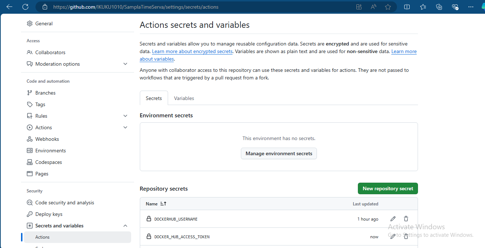
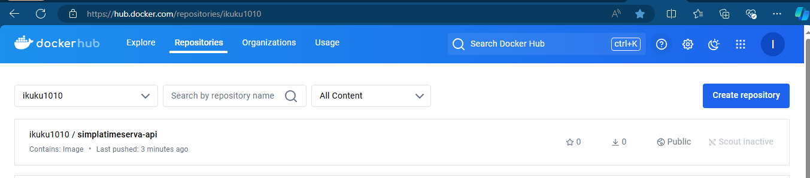

# SamplaTimeServa App

## Task Overview:

### The task is aimed at setting up a CI/CD pipeline for a Date/Time server API:

#### Pipeline Trigger:

The pipeline should automatically start when a push event occurs on the main branch of GitHub repository.

#### Build and Test Process:

The pipeline will first build the project (e.g., compiling code or packaging it). After the build, it will run automated tests to ensure code correctness. 

#### Deployment to Staging:

If all tests pass, the pipeline will automatically deploy the application to a staging environment, where it can be further tested before production. 

## What is a Staging Environment?

A staging environment is an intermediate environment used to test the application before it goes live in production. It mimics the production environment closely but is separate to prevent any impact on actual users. It's used to test new changes and ensure they work correctly in an environment similar to the live system.

## Examples of Staging Environments:

1. A cloud-based environment like AWS, Google Cloud, or Azure.
1. A separate server or Docker container where the application runs just like it would in production.
1. For small projects, it could be a subdomain or a dedicated space on a hosting platform.

For this task, I used Docker hub as the staging environment. The actual staging environment is the GitHub Actions runner itself, which runs the app in a Docker container.

## Steps

### Set Up GitHub Repository

I set up the github repository to store the files for this task and as well as run the github actions CICD workflow.

After that set up your github actions secrets to enable workflow login access to your docker hub repository

### Create an App 

I created a Simple fast API App using python and html code. The app is an API that displays date and time and links to notable events that happend on that date in history.

The code for this app is stored on the main.py file on this repo.

### Run the app locally

We will build and run the app locally by using docker engine to build the app image and confirm its running

### confirm app is running and functionally

Our app is functioning perfectly after docker run command as shown below;

 

### Write the GitHub Actions Workflow for CI/CD

Since we have confirmed App is running functionally and well . The next step is to yse github actions to automate the deployment of this app and as well as ensue continous integration.

The code for the CI/CD workflow is stored on the .github/workflows directory on this repo.

## Conclusion

1. Once you push changes to the main branch, the CI/CD pipeline will:

1. Build the project: Install dependencies and run the build process.

1. Run Tests: Execute the tests in tests/.

1. Deploy: If the tests pass, the pipeline will deploy the app (in this case, by running it in a Docker container).

The app was suucessfully tested, built and pushed to staging environment (Dockerhub) and CI is deployed as shown:

 
 

